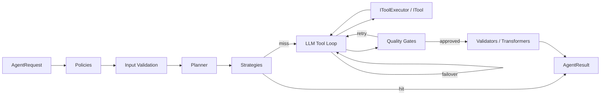

# Runtime Pipeline

`IAgentRuntime` is the main engine of the library. You give it a goal, and
it does the work. Internally it goes through a series of steps. Every step
is optional: you can add your own, replace the default one, or leave it out.

The steps, in order:

1. **Policies** — check the request first. A policy can block a request
   before anything runs (for example: block dangerous requests).
2. **Input validators** — check that the input is correct. If the input is
   wrong, the run stops here.
3. **Planner** — split the goal into smaller steps before starting.
4. **Strategies** — fixed answers for simple goals. A strategy is plain
   code, so it needs no LLM call and costs nothing.
5. **LLM tool loop** — the main work. The runtime sends the goal and the
   tool list to the model. The model can call tools, the runtime runs them
   (through `IToolExecutor`), and the loop continues until the model is
   done. The loop calls the LLM in either **buffered** mode (one call,
   wall-clock timeout) or **streaming** mode (token by token, idle-based
   timeout) — see [LLM Client](llm-client.md#buffered-vs-streaming). On a
   transient failure (e.g. timeout), the loop can
   [fail over to the next candidate model](../execution/model-failover.md)
   if failover is enabled.
6. **Quality gates** — check the model's answer. If the answer is not good
   enough, the runtime sends the feedback back to the model and tries again.
7. **Validators and transformers** — final checks on the result, then
   convert it into the final form.
8. **Observers** — get a message about each step (start, finish, error), so
   you can log or monitor the run.

A minimal call looks like this:

```csharp
var result = await runtime.RunAsync(new AgentRequest(
    Goal: "Find the API documentation for provider X",
    AllowedToolNames: ["search_web", "fetch_url"],
    Parameters: new Dictionary<string, object> { ["max_turns"] = 5 }
));

// Result: Success, Output, Reasoning, Steps, Usage, Metadata
```

## Pipeline Flow

The diagram below shows the same steps. Read it from left to right. Two
things can happen without the LLM: a strategy can answer the goal directly
(edge `hit`), or a quality gate can reject the answer and send it back to
the model (edge `retry`).



## Allowed Tools

### How does the model know which tools it can use?

The model knows nothing about tools by itself. It only knows the tools that
are sent to it inside the request.

Every registered tool has three things: a **name**, a **description** (what
the tool does), and a **parameter schema** (what input the tool needs).
With every call, the runtime puts these definitions into the `tools` field
of the request:

```json
{
  "messages": [ "... the goal ..." ],
  "tools": [
    {
      "name": "fetch_url",
      "description": "Download the content of a web page",
      "parameters": { "url": "string" }
    },
    {
      "name": "search_web",
      "description": "Search the web",
      "parameters": { "query": "string" }
    }
  ]
}
```

The model reads this list and can only choose a tool from this list. If a tool
is not in the list, the model does not know that it exists — so it can never
call it. This restriction is also checked a second time, when the tool call
comes back: if the model names an excluded tool anyway, the runtime refuses
to run it and tells the model so.

There are two layers:

1. **The tool registry** — all tools your application registered. It defines
   what is *possible*.
2. **`AllowedToolNames`** — a filter on top of the registry. It never adds
   tools. It only reduces which tools are sent with the request for this run.

```text
Registered tools:   search_web, fetch_url, verify_url
         │
         ▼   AllowedToolNames filter (applied before the call)
Tools in request:   depends on the value — see the table below
         │
         ▼
The model:          can only call the tools it received
```

### The three ways to set `AllowedToolNames`

There are three possible values. The difference between case 1 and case 3 is
one argument value — `null` versus `[]`. But the effect is very different:

- With `null`, tools are sent in the request. The model can call them, and
  the run becomes a loop: the model calls a tool, gets the result, and
  continues.
- With `[]`, no tools are sent. The model cannot call anything and must
  answer directly with one text response.

```csharp
// 1. null — no restriction.
//    All registered tools are sent to the model.
//    (Leaving the argument out has exactly the same effect.)
var request = new AgentRequest(
    "Research the pricing page for provider X",
    AllowedToolNames: null);

// 2. A list of names — only these tools are sent to the model.
//    A name that matches no registered tool is simply ignored.
var request = new AgentRequest(
    "Research the pricing page for provider X",
    AllowedToolNames: ["search_web", "fetch_url"]);

// 3. An empty list — no tools at all.
//    The model answers directly with text. It can never call a tool.
var request = new AgentRequest(
    "Summarize these findings",
    AllowedToolNames: []);
```

| Value passed | Tools in the request | Result of the run |
| --- | --- | --- |
| `AllowedToolNames: null` (or omitted) | All registered tools | Loop: model calls tools, results are fed back, model continues |
| `AllowedToolNames: ["search_web", "fetch_url"]` | Only the listed tools | Same loop, but only with these tools |
| `AllowedToolNames: []` | None | One direct text answer. Tool calls are impossible |

Case 3 exists for workflows where some steps only need thinking — for
example: judge the evidence, pick the best candidate, or format the final
text. Such a step needs no tools. With `[]`, the model cannot waste turns on
tool calls it never needed.

!!! note "Migration from 1.0.0"
    In 1.0.0 `null` and an empty list behaved the same: both meant "all
    tools". Case 3 was impossible to express. If you build the list
    dynamically and want "all tools" when nothing is added, pass `null`
    instead of an empty list:

    ```csharp
    var tools = new List<string>();
    if (needSearch) tools.Add("search_web");

    // An empty list now means "no tools".
    // For "all tools", pass null instead.
    var request = new AgentRequest(goal, tools.Count > 0 ? tools : null);
    ```

## Progress Reporting in the Tool Loop

During a tool-loop run, the runtime reports its progress via the `IProgress<string>`
callback (passed to `RunAsync`) and the `Steps` list on the result. The following
messages are surfaced:

| When | Message format | Example |
| --- | --- | --- |
| Tool call starts | `Calling tool {name}({arguments})` | `Calling tool fetch_url({"url":"..."})` |
| Tool call finishes successfully | Two-space indent + `{name} succeeded` with an optional first-line summary | `  fetch_url succeeded: ## Pricing Plans...` |
| Cached result is reused | Two-space indent + `{name} reused cached result` with an optional first-line summary | `  fetch_url reused cached result: ## Pricing Plans...` |
| Tool call fails | Two-space indent + `{name} failed: {error}` | `  fetch_url failed: timeout` |
| Model decision | Two-space indent + `[{model}] Decision: {tool} — "{key argument}"` | `  [configured-model] Decision: fetch_url — "https://test.example.com/pricing"` |
| Model content with tool calls | Two-space indent + model content, truncated if > 500 chars | `  Let me check the pricing page directly` |
| Final response | `LLM returned final response.` | — |
| Turn exhausted | `Turn {n} produced no content and no tool calls.` | — |

Successful non-empty tool results show the first line of output as a human-readable
preview. The complete preview, including `...` when truncation occurs, is limited
to 100 characters. Empty and whitespace-only output does not add a summary. The
complete tool output is still passed to the next LLM turn; only the progress and
`Steps` display is shortened.

When the configured executor implements `ICacheAwareToolExecutor`, the runtime
probes for a cached result after the decision line and before reporting a real
invocation. A hit emits the distinct `reused cached result` progress step and
passes the complete cached output to the next LLM turn. It does not emit the
normal `Calling tool ...` step, increment the tool invocation counter, notify tool
invocation/completion observers, publish tool bus events, or emit
`ToolStartedEvent`/`ToolCompletedAgentEvent`. Cache misses and ordinary
`IToolExecutor` implementations retain the normal path. See
[Tool Idempotency](../tools/tool-idempotency.md) for wiring requirements.

Before each valid tool call, the runtime reports deterministic decision metadata:
the active model label, tool name, and one scalar argument. It prefers arguments
named `url`, `uri`, `query`, or `path`, then uses the first scalar argument in
ordinal key order. If no scalar argument exists, it reports `(no scalar argument)`.
This metadata identifies the selected action; it is not reconstructed model
reasoning. When ordinary model content accompanies tool calls, that content is
reported before the decision line. If the content is a JSON object with a
string-valued top-level `reasoning` property, that property is displayed instead
of the complete JSON envelope. Malformed or non-JSON content remains safe and is
reported using the existing content fallback.

!!! note "Progress vs. Streaming Events"
    The progress callback and `AgentResult.Steps` are used by `RunAsync`.
    `RunStreamingAsync` continues to expose its existing structured events for
    real tool executions, including `ModelChunkEvent`, `ToolStartedEvent`, and
    `ToolCompletedAgentEvent`. A pre-invocation cache hit intentionally omits
    the normal tool lifecycle events; this adds no new streaming event type.

## Extension Points

Every step in the pipeline is an interface. To add your own behavior, write
a class that implements the interface, and register it in DI with the
matching `Add...` method:

| Stage | Interface | Register with |
| --- | --- | --- |
| Policies | `IAgentPolicy` | `AddAgentPolicy<T>()` |
| Input validation | `IAgentInputValidator` | `AddAgentInputValidator<T>()` |
| Planning | `IAgentPlanner` | `AddDefaultPlanner()`, `AddNamedPlanner<T>()` |
| Strategies | `IAgentStrategy` | `AddAgentStrategy<T>()` |
| Tool execution | `IToolExecutor` | `AddAgentToolExecutor<T>()` |
| Quality gates | `IAgentQualityGate` | `AddAgentQualityGate<T>()` |
| Validators | `IAgentResultValidator` | `AddAgentResultValidator<T>()` |
| Transformers | `IAgentResultTransformer` | `AddAgentResultTransformer<T>()` |
| Observers | `IAgentObserver` | `AddAgentObserver<T>()` |
| Model failover | Internal (`ILlmErrorClassifier`) | Built-in; enabled globally via `AgentRuntimeOptions.EnableModelFailover` or per-request via the `enable_model_failover` property — see [Model failover](../execution/model-failover.md) |

By default, a registered class runs for every agent. You can also register
it for one agent only — see
[agent-scoped registration](../execution/agent-scoping.md).
