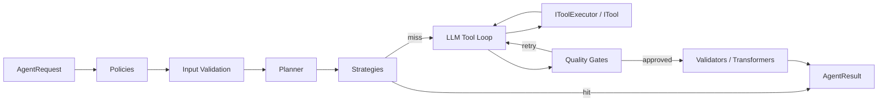

# Runtime Pipeline

`IAgentRuntime` is the orchestrator. Given a goal and a set of tools, it runs
a middleware pipeline where every stage is optional and replaceable:

1. Evaluates all registered **policies** — block disallowed actions before
   anything runs
2. Runs **input validators** — per-agent input checks that short-circuit on
   failure
3. Runs the **planner** — decompose the goal into steps before execution
4. Tries each **strategy** — deterministic shortcuts that bypass the LLM
5. Falls back to the **LLM tool loop** — sends the goal and tool definitions
   to the LLM, receives tool calls, executes them through `IToolExecutor`,
   and loops until done
6. Evaluates **quality gates** — retry the LLM output with gate feedback
7. Runs simple **validators**, then ordered **transformers**
8. Notifies registered **observers** about lifecycle events

```csharp
var result = await runtime.RunAsync(new AgentRequest(
    Goal: "Find the API documentation for provider X",
    AllowedToolNames: ["search_web", "fetch_url"],
    Parameters: new Dictionary<string, object> { ["max_turns"] = 5 }
));

// Result: Success, Output, Reasoning, Steps, Usage, Metadata
```

## Pipeline Flow



## Allowed Tools

The request controls which tools the LLM may see through
`AllowedToolNames`. Tools outside this list are not offered to the model,
even if they are registered.

## Extension Points

| Stage | Interface | Register with |
| --- | --- | --- |
| Policies | `IAgentPolicy` | `AddAgentPolicy<T>()` |
| Input validation | `IAgentInputValidator` | `AddAgentInputValidator<T>()` |
| Planning | `IAgentPlanner` | `AddDefaultPlanner()`, `AddNamedPlanner<T>()` |
| Strategies | `IAgentStrategy` | `AddAgentStrategy<T>()` |
| Tool execution | `IToolExecutor` | `AddAgentToolExecutor<T>()` |
| Quality gates | `IAgentQualityGate` | `AddAgentQualityGate<T>()` |
| Validators | `IAgentResultValidator` | `AddAgentResultValidator<T>()` |
| Transformers | `IAgentResultTransformer` | `AddAgentResultTransformer<T>()` |
| Observers | `IAgentObserver` | `AddAgentObserver<T>()` |

Every extension point also supports
[agent-scoped registration](../execution/agent-scoping.md).
