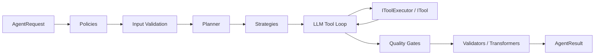

# AiCleverness Developer Manual

AiCleverness is a provider-neutral execution runtime for .NET — policies,
planning, deterministic strategies, tool execution, quality gates,
transformations, and observability around any LLM provider adapter.

AiCleverness is a NuGet library. Agents are one execution pattern; the core
value is orchestration. Every extension point sits behind a small interface,
so you can test policies, strategies, and tools in isolation and swap
providers without touching calling code.

## Feature Overview

| Capability | Entry point | Description |
| --- | --- | --- |
| Orchestration | `IAgentRuntime` | Middleware pipeline: policies → planning → strategies → LLM loop → quality gates → validators → transformers |
| Streaming | `IStreamingAgentRuntime` | Real-time execution events via `IAsyncEnumerable<AgentEvent>` |
| Tools | `ITool`, `IToolExecutor` | Register tools, the runtime handles discovery and invocation |
| Policies | `IAgentPolicy` | Pre-execution guardrails that can block runs |
| Strategies | `IAgentStrategy` | Deterministic shortcuts bypassing the LLM |
| Planning | `IAgentPlanner` | Goal decomposition into steps before execution |
| Quality Gates | `IAgentQualityGate` | Output evaluation with retry support |
| Memory | `IWorkingMemory`, `ILongTermMemory`, `IVectorMemory` | Tiered memory behind `IAggregateMemory` |
| Security | `IPromptGuard`, `IApprovalService`, `IScopeValidator` | Input/output guards, human-in-the-loop approval |
| Workflows | `WorkflowDefinition` | DAG-based multi-agent workflows |
| Observability | `IMetricsCollector`, `IDiagnosticCollector` | Structured metrics and diagnostic traces |
| DI | `AddAiClevernessRuntime()` | One-line `IServiceCollection` integration |

## Architecture at a Glance

All capabilities sit behind small abstractions in the `AiCleverness.Abstractions`
namespace. The runtime orchestrates them without knowing provider-specific
implementation details:

## Where to Start

- New to the library? Read [Installation](getting-started/installation.md)
  and the [Quick Start](getting-started/quick-start.md).
- Wiring up a real application? See
  [Dependency Injection](getting-started/dependency-injection.md) and the
  [Runtime Pipeline](concepts/runtime-pipeline.md).
- Looking for a specific type? See the
  [API Reference](api-reference/interfaces.md).

## License

MIT — see the `LICENSE.txt` in the repository.
