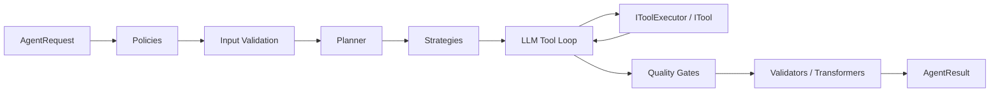

# AiCleverness Developer Manual

AiCleverness is a .NET library that runs AI agents. You give it a goal,
and it does the work: it calls your LLM, lets the model use tools, checks
the answer, and returns the result. It works with **any** AI provider,
because you bring your own connection through one small interface.

Around this core, the library gives you: guards that run before the work,
planning, checks on the answer, transformations, memory, and monitoring.

Every part sits behind a small interface. This means you can test each part
alone, and you can change your AI provider without changing the rest of
your code.

## Feature Overview

| Feature | Entry point | What it does |
| --- | --- | --- |
| The runtime | `IAgentRuntime` | The main pipeline: policies → input check → planning → strategies → LLM loop → quality gates → validators → transformers |
| Streaming | `IStreamingAgentRuntime` | See what happens while the run is working, event by event |
| Tools | `ITool`, `IToolExecutor` | Register tools; the runtime finds them and calls them |
| Policies | `IAgentPolicy` | Guards before the run; can stop the run |
| Strategies | `IAgentStrategy` | Answer the goal with plain code, without the LLM |
| Planning | `IAgentPlanner` | Split the goal into steps before starting |
| Decision Trees | `DecisionTreeExecutor` | Run bounded JSON workflows with actions, questions, predicates, and terminal verdicts |
| Quality Gates | `IAgentQualityGate` | Check the answer; can ask the model to try again |
| Memory | `IWorkingMemory`, `ILongTermMemory`, `IVectorMemory` | Three memory types behind `IAggregateMemory` |
| Security | `IPromptGuard`, `IApprovalService`, `IScopeValidator` | Checks on input and output, and approval by a human |
| Workflows | `WorkflowDefinition` | Several connected steps and agents |
| Observability | `IMetricsCollector`, `IDiagnosticCollector` | Numbers and traces about your runs |
| DI | `AddAiClevernessRuntime()` | Connect everything to DI with one line |

## Architecture at a Glance

Most extension points are small interfaces in the
`AiCleverness.Abstractions` namespace. The runtime puts them together and
does not need to know any details about your AI provider:

## Where to Start

- New to the library? Read [Installation](getting-started/installation.md)
  and the [Quick Start](getting-started/quick-start.md).
- Building a real application? See
  [Dependency Injection](getting-started/dependency-injection.md) and the
  [Runtime Pipeline](concepts/runtime-pipeline.md).
- Looking for a specific type? See the
  [API Reference](api-reference/interfaces.md).

## License

MIT — see the `LICENSE.txt` in the repository.
